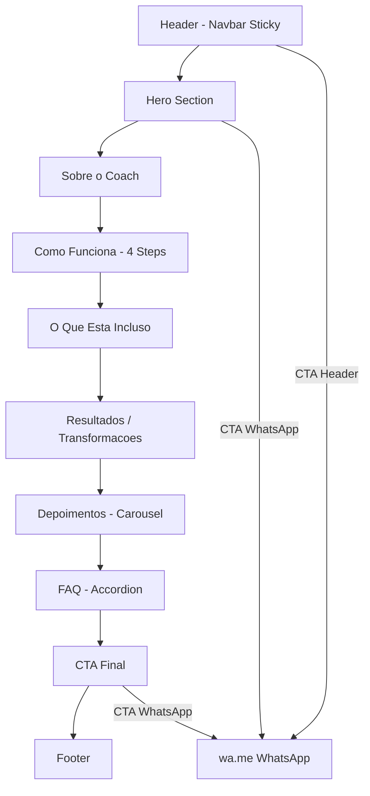

# Plano - Landing Page: Treinador Oliveira Rodrigo

## Visão Geral do Negócio

**Nome:** Treinador Oliveira Rodrigo  
**Serviço:** Consultoria de Treino Online Personalizada  
**Profissão:** Coach / Fisiologista do Exercício  
**Instagram:** @treinador_oliveirarodrigo  
**WhatsApp CTA:** wa.me/message/GK5PKFMETDUGB1  

### Proposta de Valor
- Resultados em 12 semanas
- Treino por aplicativo + Avaliação diagnóstica + Suporte por WhatsApp + E-book
- Todo mês um treino novo
- Foco em constância, método, segurança e resultado
- Para pessoas que querem mudar o corpo, saúde e disciplina, mesmo com pouco tempo

---

## Stack Tecnológica

- **Framework:** Next.js 14 (App Router)
- **Estilização:** Tailwind CSS
- **Componentes UI:** Shadcn/ui
- **Animações:** Framer Motion
- **Imagens:** Unsplash (via MCP) + placeholders para depoimentos
- **Linguagem:** TypeScript

---

## Design System

### Paleta de Cores
- **Background principal:** `#0a0a0a` (preto profundo)
- **Background secundário:** `#111111` (cinza muito escuro)
- **Background cards:** `#1a1a1a` (cinza escuro)
- **Accent primário:** `#f97316` (laranja - orange-500)
- **Accent hover:** `#ea580c` (laranja escuro - orange-600)
- **Accent glow:** `#fb923c` (laranja claro - orange-400)
- **Texto primário:** `#ffffff` (branco)
- **Texto secundário:** `#a3a3a3` (cinza neutro)
- **Bordas:** `#262626` (cinza escuro sutil)

### Tipografia
- **Headings:** Font bold/extrabold, tracking-tight
- **Body:** Font normal, leading relaxed
- **Fonte base:** Inter (via next/font)

### Padrões de Animação (Framer Motion)
- Fade-in + slide-up ao entrar na viewport
- Stagger children para listas e cards
- Scale hover em botões e cards
- Parallax sutil no hero

---

## Estrutura de Seções

### 1. Header/Navbar
- Logo/nome "Rodrigo Oliveira" à esquerda
- Links de navegação: Sobre, Método, Resultados, Depoimentos, FAQ
- Botão CTA "Fale Comigo" (WhatsApp) à direita
- Sticky com backdrop-blur no scroll
- Menu hamburger no mobile

### 2. Hero Section
- Headline: "Transforme Seu Corpo com Treino Personalizado e Acompanhamento Profissional"
- Subheadline: "Resultados reais em 12 semanas com método, segurança e constância. Consultoria 100% online."
- Dois botões: "Quero Começar Agora" (WhatsApp) + "Saiba Mais" (scroll)
- Imagem de fundo: foto fitness do Unsplash com overlay escuro
- Badge: "🔥 Vagas Limitadas"
- Stats rápidos: "+1600 seguidores" | "12 semanas" | "100% online"

### 3. Sobre o Coach
- Foto do coach (Unsplash placeholder - personal trainer masculino)
- Título: "Quem é o Rodrigo Oliveira?"
- Texto: Fisiologista do exercício, especialista em treino personalizado online, focado em resultados com base científica
- Credenciais em badges: Fisiologista do Exercício, Coach Certificado, +X alunos transformados

### 4. Como Funciona (Metodologia)
- Título: "Como Funciona a Consultoria"
- 4 steps em cards com ícones:
  1. **Anamnese** - Avaliação diagnóstica completa do seu perfil
  2. **Treino Personalizado** - Plano 100% adaptado ao seu objetivo, rotina e limitações
  3. **Acompanhamento** - Suporte contínuo por WhatsApp + ajustes mensais
  4. **Resultados** - Evolução real com segurança e constância
- Visual: timeline vertical no mobile, horizontal no desktop

### 5. O Que Está Incluso
- Título: "Tudo Que Você Recebe"
- Grid de benefícios com ícones:
  - 🏋️ Treino personalizado por aplicativo
  - 📋 Avaliação diagnóstica (anamnese)
  - 📱 Suporte por WhatsApp
  - 📖 E-book exclusivo
  - 🔄 Treino novo todo mês
  - 📊 Acompanhamento de evolução
- Card destacado com CTA

### 6. Resultados / Transformações
- Título: "Resultados Que Falam Por Si"
- Texto: "Não adie a transformação que seu corpo merece. A hora é agora!"
- Grid de cards com antes/depois (placeholders com overlay)
- Nota: imagens placeholder com texto "Antes" e "Depois"
- Frase motivacional: "Ir pra academia é muito mais sobre constância do que altas cargas"

### 7. Depoimentos
- Título: "O Que Nossos Alunos Dizem"
- Carousel/grid de depoimentos com:
  - Avatar placeholder (círculo cinza com iniciais)
  - Nome fictício
  - Texto do depoimento
  - Rating em estrelas
- 6 depoimentos fictícios relacionados a treino online
- Componente de carousel com Shadcn

### 8. FAQ
- Título: "Perguntas Frequentes"
- Accordion (Shadcn) com perguntas:
  - Como funciona a consultoria online?
  - Preciso ter experiência na academia?
  - Como recebo meu treino?
  - Com que frequência o treino é atualizado?
  - O suporte por WhatsApp funciona como?
  - Quanto tempo para ver resultados?

### 9. CTA Final
- Background com gradiente laranja
- Título: "Pronto Para Sua Transformação?"
- Subtítulo: "Preço imperdível por tempo limitado! Treine com método, segurança e resultado."
- Botão grande: "Entre em Contato pelo WhatsApp"
- Urgência: "Vagas limitadas para este mês"

### 10. Footer
- Logo/nome
- Links rápidos
- Link Instagram
- Link WhatsApp
- Copyright

---

## Estrutura de Arquivos

```
/
├── app/
│   ├── layout.tsx          # Layout raiz com fontes e metadata
│   ├── page.tsx            # Página principal montando todas as seções
│   └── globals.css         # Estilos globais + Tailwind
├── components/
│   ├── ui/                 # Componentes Shadcn
│   ├── header.tsx          # Navbar
│   ├── hero.tsx            # Seção Hero
│   ├── about.tsx           # Sobre o Coach
│   ├── method.tsx          # Como Funciona
│   ├── benefits.tsx        # O Que Está Incluso
│   ├── results.tsx         # Resultados/Transformações
│   ├── testimonials.tsx    # Depoimentos
│   ├── faq.tsx             # FAQ
│   ├── cta-section.tsx     # CTA Final
│   └── footer.tsx          # Footer
├── lib/
│   └── utils.ts            # Utilitários (cn, etc)
├── public/
│   └── images/             # Imagens do Unsplash
├── tailwind.config.ts
├── next.config.js
├── package.json
└── tsconfig.json
```

---

## Imagens Necessárias (Unsplash)

1. **Hero background** - gym/fitness atmosphere (landscape, dark)
2. **Coach placeholder** - personal trainer masculino (portrait)
3. **Resultados** - pessoa treinando na academia (2-3 fotos)
4. **Benefícios** - equipamento de academia / app de treino

---

## Diagrama de Fluxo da Página



---

## Componentes Shadcn Necessários

- `Button` - CTAs e navegação
- `Card` - Cards de benefícios, método, depoimentos
- `Accordion` - FAQ
- `Badge` - Tags e credenciais
- `Sheet` - Menu mobile
- `Avatar` - Fotos de depoimentos
- `Carousel` - Slider de depoimentos (se disponível, senão grid)
